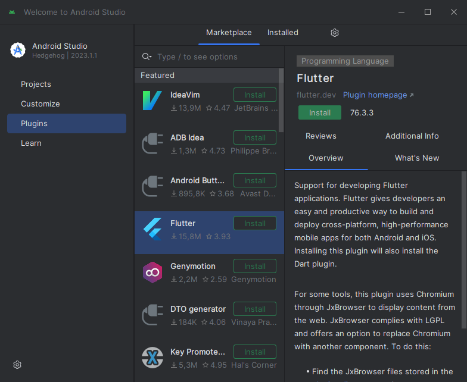
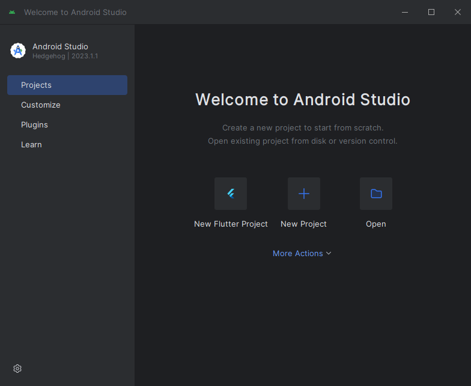

# Instructions

Download and install Android Studio from [https://developer.android.com/studio](https://developer.android.com/studio).

Accept all the defaults and the license agreements, except that you don't want to import existing settings.

Open **Android Studio**

Click **More Actions** under **Projects**, select **SDK Manager**.


Check **Android SDK Command-line Tools (latest)** and click **OK**.


Accept all the questions.

You should now be back to the "Welcome to Android Studio" screen.

Click **Plugins** in left panel.



Install **Flutter** pluging and **Restart IDE**.

That should add a **New Flutter Project** button to the welcome screen as seen below.



## Verify installation

In "GIT Bash" (or "Terminal" on Mac) run:

```sh
flutter doctor --android-licenses
```

Answer `y` to all questions, then:

```sh
flutter doctor
```

It should look something like:


Verify that there is a checkmark for the following:

```
[√] Flutter
[√] Android toolchain develop for Android devices
[√] Chrome develop for the web
[√] Android Studio
```

# Done 🥳