# [📺 Video](https://easv.cloud.panopto.eu/Panopto/Pages/Viewer.aspx?id=c2a6f1e2-dca0-4462-96a0-b0d100e54e5b)

# Instructions

## Prerequisite

Open "Terminal" app (search in spotlight).

Type `git` to verify that you have GIT installed.
If you don't it will ask you if you want to install developer tools, go ahead and do that.

If you are on the new Apple Silicon Mac you need to install the translation layer for x86 code.

```sh
sudo softwareupdate --install-rosetta --agree-to-license
```

## Install Flutter-SDK

Now get flutter directly from github

```sh
cd ~
git clone https://github.com/flutter/flutter.git -b stable
```

You need to figure out what shell you are using.

```sh
echo $SHELL
```

Edit `$HOME/.bashrc` or `$HOME/.zshrc` depending on the output.
For the rest if the text I'm going to assume you are using zsh so the shell
config is referred to as `.zshrc`.

You can use either `vim` or `nano` to edit the config.
In `nano` you can save with *Control+o* then exit with *Control+x*.
In `vim` it is *ESCAPE* then type `:wq` .

Add following line at the end of the file:

```sh
export PATH="$PATH:$HOME/flutter/bin"
```

Save and reboot.

Run following command to check flutter dependencies:

```sh
flutter doctor
```

Install **Chrome** if missing.

Don't worry about the other issues for now.

---

## iPhone

If you have an iPhone and would like to be able to build your Flutter projects
for it, then there is a bit of extra setup you need to do.

If you don't have an iPhone then skip to [here](./android_studio.md).

To build for iPhone you will need Xcode which can be found in App Store.
So go ahead and install it!

To make plugins work for iPhone you need to have
[CocoaPods](https://cocoapods.org/) installed.
But before you can install it you will need a couple of other things.

Install [Homebrew](https://brew.sh/) if you don't have it already.
If you are unsure, you can check by entering `brew` in Terminal.

```sh
# To install Homebrew
/bin/bash -c "$(curl -fsSL https://raw.githubusercontent.com/Homebrew/install/HEAD/install.sh)"
```

You can use brew to install Ruby which is required by CocoaPods.

```sh
brew install ruby
```

Then add a couple of more environment variables to `.zshrc`.

```sh
export PATH="/opt/homebrew/opt/ruby/bin:$PATH"
export LDFLAGS="-L/opt/homebrew/opt/ruby/lib"
export CPPFLAGS="-I/opt/homebrew/opt/ruby/include"
```

Finally install CocoaPods with:

```sh
brew install cocoapods
brew link cocoapods
```

Hopefully you should see a checkmark for cocoapods now when running `flutter doctor` .

Then to setup xcode.

```sh
sudo sh -c 'xcode-select -s /Applications/Xcode.app/Contents/Developer && xcodebuild -runFirstLaunch'
xcodebuild -downloadPlatform iOS
sudo xcodebuild -license
```

### Developer mode

Next, you need to pair your phone.
Connection it with a cable as usual.

Create a new Flutter project by running:

```sh
flutter create ios_test --platforms=ios
```

It will create the project in a subfolder of your current working directory.
You can either do it by opening op Xcode, then select "File"->"Open Folder" and
browse to the location.
Or from Terminal using:

```sh
open ios_test/ios/Runner.xcworkspace
```

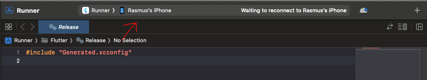

That unlocks a new "Developer Mode" menu  on you iPhone, under
"Settings"->"Privacy & Security".
Enable it and restart.

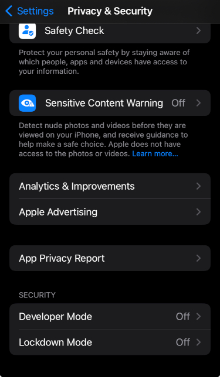
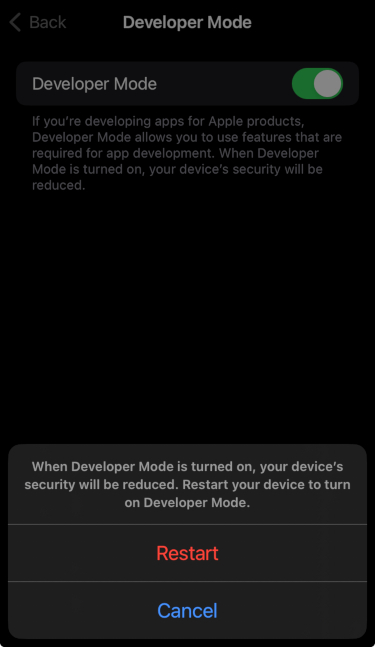

After restart.
You should see a dialog like shown.
Just select "Turn On".

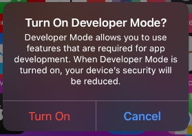

### Signing

Go to **Xcode**->"Settings...".
Then under "Accounts" tab, click the + and select "Apple ID".
Enter your Apple ID credentials.

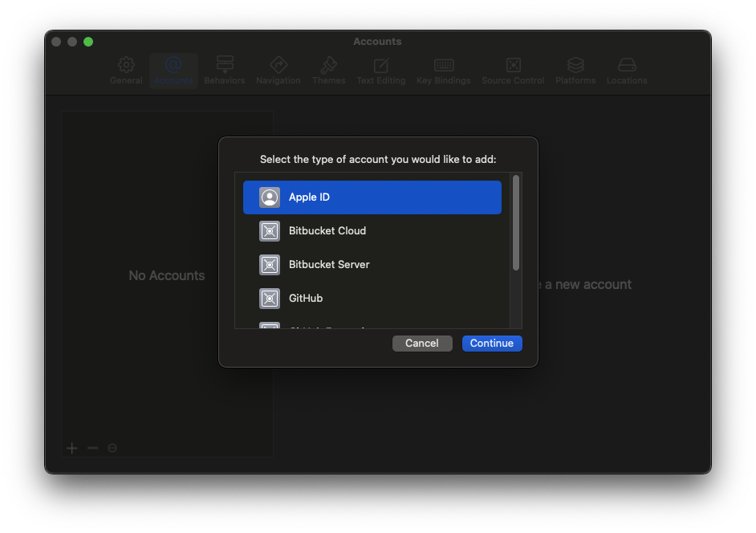

Close the settings window.

Click on the Play icon in the top bar, then "Runner" in the left panel.

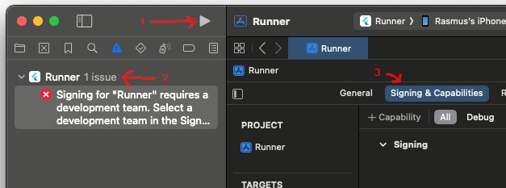

Under "Signing & Capabilities" tab, click on the "Team" dropdown and select "{Your name} (Personal Team)".

In "Bundle Identifier" field you must invent a unique name for you app.

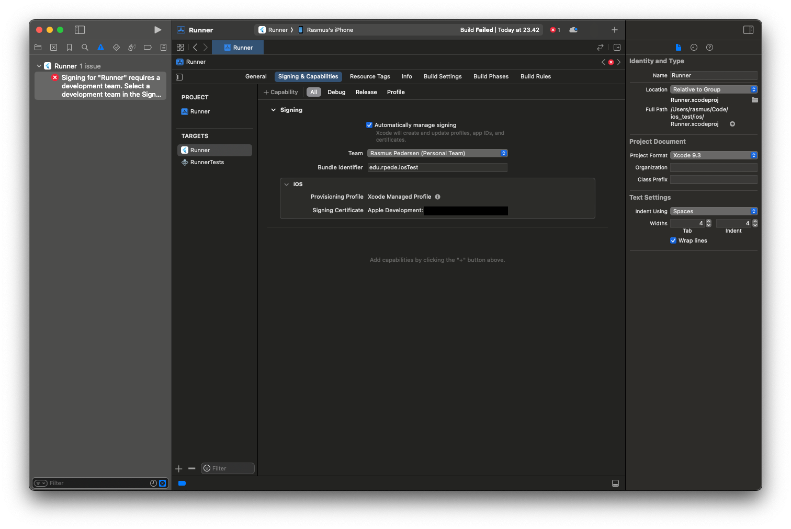

Before you can run the app, you need to find the device id.

```sh
flutter devices
```

It should list all devices that Flutter is able to run the project on.
Copy the **id** field for your iPhone.
Then do:

```sh
cd ios_test
flutter run -d < your phones id >
```

First time you run a project you will get the following message.

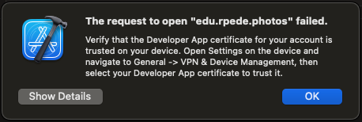

Do as the messages says.
It should look like the screenshots below.

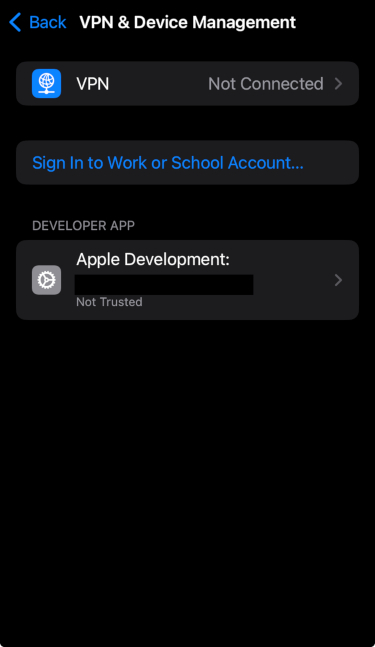
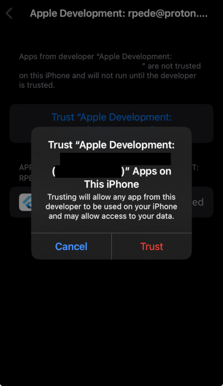

Close Xcode and run the project again with:

```sh
flutter run -d < your phones id >
```

If everything went well, you should see the following:

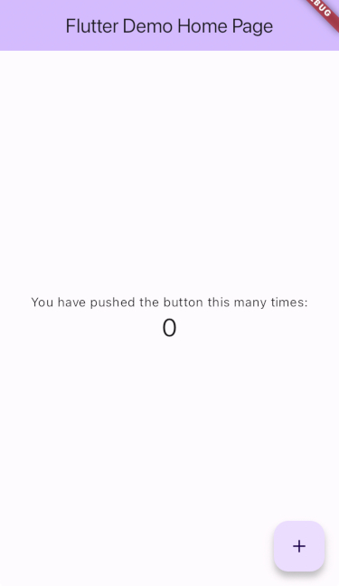

Here are a couple of links that could help if you get stuck.

- [Start building Flutter iOS apps on macOS](https://docs.flutter.dev/get-started/install/macos/mobile-ios?tab=physical)
- [Enabling Developer Mode on a device](https://developer.apple.com/documentation/xcode/enabling-developer-mode-on-a-device)

---

Next you will install an IDE for Flutter, namely Android Studio.
Don't let the name fool you, as it is great for Flutter development no matter the platform.

# [Continue](android-studio)
