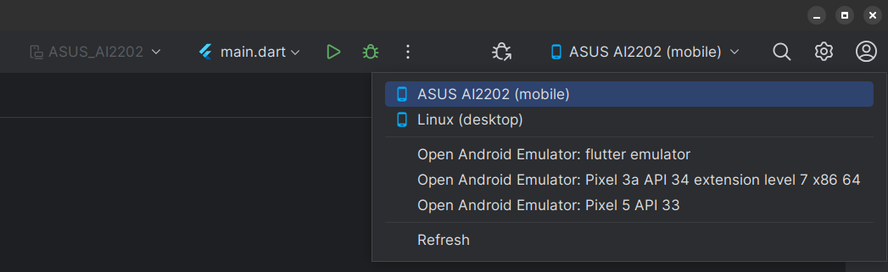

You can use a real Android phone for development instead of the emulator.
But before you can do that, you need to enable developer mode on you device.
The following video shows how to do it.
Your phone might look slightly different from mine, but the general concept
should be the same.

<iframe src="https://easv.cloud.panopto.eu/Panopto/Pages/Embed.aspx?id=9af29c42-408c-4d2e-a883-b10900ff447c&autoplay=false&offerviewer=true&showtitle=true&showbrand=true&captions=false&interactivity=all" height="405" width="720" style="border: 1px solid #464646;" allowfullscreen allow="autoplay" aria-label="Panopto Embedded Video Player"></iframe>

1. Open "Settings".
2. Go to "System".
3. Then "About phone".
4. And "Software information".
5. Keep tapping "Build number" until you get a message saying you are developer.
6. Find the new "Developer options" menu, under "System".
7. Enable "Use developer options" and "USB debugging".
8. Connect phone to your computer and "Allow USB debugging".
9. Select your phone under device selection in Android Studio.

